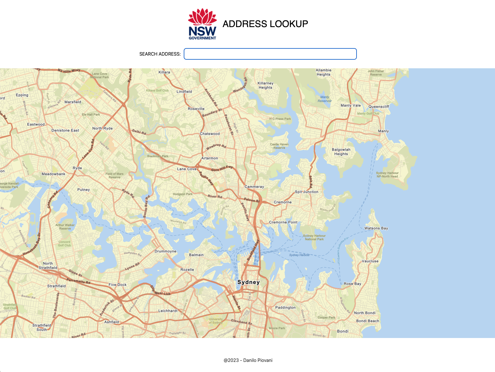
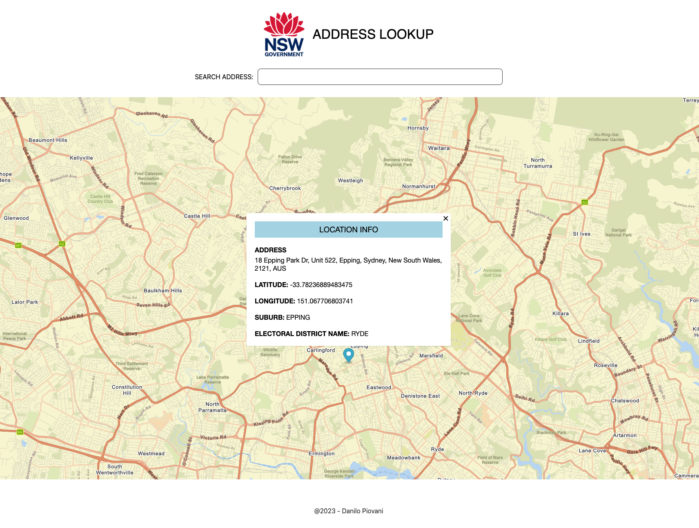
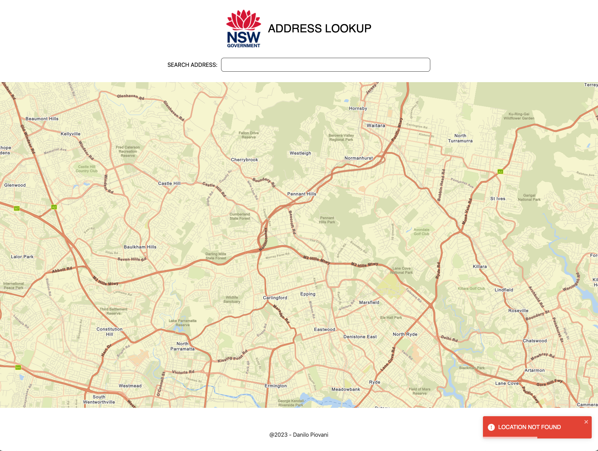
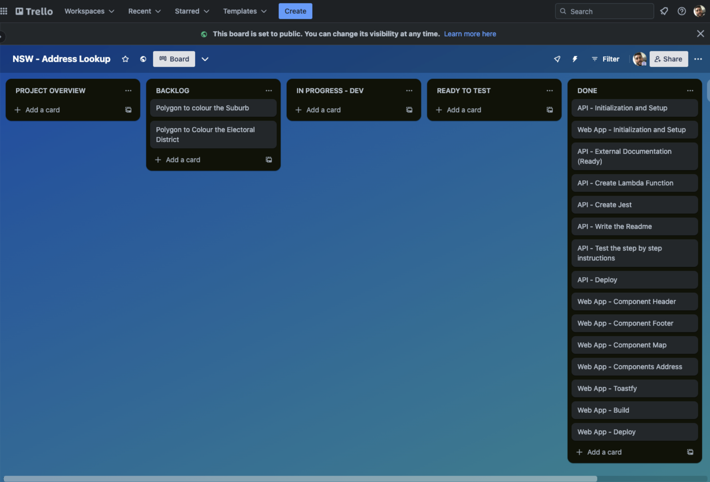

# NSW Challenge AWS Lambda Function

This repository contains an AWS Lambda function built using the Serverless Application Model (SAM) for the NSW Challenge. The Lambda function fetches location data based on an address and returns information about the location, suburb name, and state electoral district.

## Prerequisites

Before running the Lambda function locally, make sure you have the following prerequisites installed on your system:

- [Node.js](https://nodejs.org/)
- [Docker](https://www.docker.com/)
- [AWS SAM CLI](https://docs.aws.amazon.com/serverless-application-model/latest/developerguide/serverless-sam-cli-install.html)

## Clone the Repository

To get started, clone this repository to your local machine:
```bash
gh repo clone danilopiovani/nsw_challenge
```

## Dependencies
In this project, we have dependencies at two levels: project-level dependencies and Lambda layer dependencies. Here's a breakdown of what needs to be installed:

To install the project dependencies, run the following command in your terminal:

```bash
npm install
```

This command installs project-level dependencies defined in the project's package.json file, such as the AWS SAM CLI itself and development tools.


Lambda Layer Dependencies (dist/lambda/AddressApi/dependencies/dep-layer/):
Additionally, we have specific dependencies used by the Lambda function, which are located within the Lambda layer. To install these dependencies, navigate to the dep-layer directory within the Lambda function's code structure:

```bash
cd dist/lambda/AddressApi/dependencies/dep-layer/
npm install
```

These dependencies are isolated and used exclusively by the Lambda function.

By following these installation steps, you ensure that both the project-level and Lambda layer dependencies are properly set up for local development and testing.

## Running Locally
Open a new terminal window.

- Navigate to the project's root directory.

- Build the SAM application:

```bash
sam build
```

## Start the local API Gateway to run the Lambda function:
```bash
sam local start-api
```

## Requests to Lambda function:
Success Example:
- http://127.0.0.1:3000/dist/lambda/AddressApi?address=59+MOBBS+LANE+EPPING

Output: 
{"location":{"latitude":151.06749047594585,"longitude":-33.78372183726172},"suburbName":"EPPING","stateElectoralDistrictName":"RYDE"}

Failure Example:
- http://127.0.0.1:3000/dist/lambda/AddressApi
- http://127.0.0.1:3000/dist/lambda/AddressApi?address=9+MOBBS+LANE+EPPING

Output:
- {"error":"Address parameter is missing"}
- {"error":"Location not found"}


## Running Tests (Jest)
To run unit tests for the Lambda function using Jest, use the following command:
```bash
npm test
```

## Invoking Lambda Function
You can also invoke the Lambda function directly using the AWS SAM CLI. Use the following command to invoke the function with different event scenarios:

Success Case 1:
```bash
sam local invoke NSWChallengeLambdaFunction --event events/success-case.json
```

Success Case 2:
```bash
sam local invoke NSWChallengeLambdaFunction --event events/success-case2.json
```

Failure Case 1:
```bash
sam local invoke NSWChallengeLambdaFunction --event events/failure-case.json
```

Success Case 2:
```bash
sam local invoke NSWChallengeLambdaFunction --event events/failure-case2.json
```

## Address Lookup Web App

Client Side App Using Address Lookup Api

I've built an web application to show the use of the Address Lookup Api. It offers autocomplete suggestions to help you quickly find the desired address.

Once you've found your address, just click on it, and the app will display the location details on the map. If, by any chance, the app can't find the location, it will let you know with an error message.

Home page


Info Popup:


Error Message


## Project Management
I decide to manage this project tasks using Trello's Scrum board. This approach helps breaking down tasks into manageable units, and providing a visual representation of project progress. With Trello's Scrum Board I can easily prioritize tasks, and track the project's development, ensuring a smooth and organized project management experience.


[Visit the Trello Board](https://trello.com/b/dYXxZdIQ/nsw-address-lookup)


## Links

[Visit the web application](https://nsw-challenge-client.vercel.app/)

[Client Repository](https://github.com/danilopiovani/nsw-challenge-client)

[LinkedIn](https://www.linkedin.com/in/danilopiovani/)


